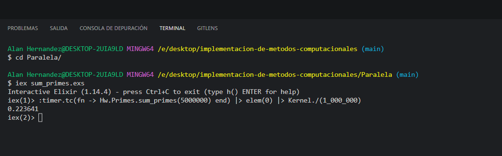
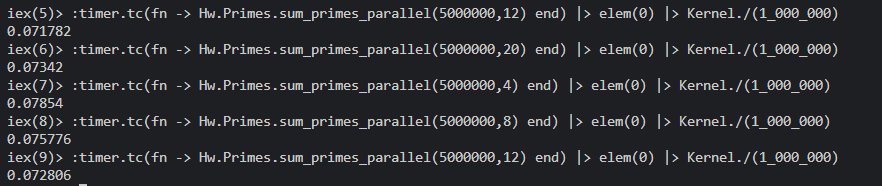

En este análisis se está probando con la suma de los numero primos en secuencial donde se ve su tiempo de ejecución donde podemos observar fue de 0.222 segundos.

Donde un pensaría que estaría adecuado este tiempo de ejecución para este rango de valores de 5 millones, sin embargo, cómo podemos observar a continuación se ve las diferentes ejecuciones del programa pero utilizando el paralelismo, que este depende del inicio y final del rango y de los hilos/task que se quiera crear, pero en este caso en nuestras computadoras son de 4 núcleos, pero se probó el rendimiento al utilizar más núcleos de los que la computadora pueda utilizar.

Al observa se puede notar que al utilizar más núcleos tuvo un mejor rendimiento por milésimas de segundos, pero los mejores tiempos fueron los de 12 núcleos, pero el peor fue al utilizar mis 4 núcleos de base, donde nos pueda hacer pensar que al estar dividiendo los rangos agilizamos más el tiempo de optimización, donde realmente estamos dividiendo el problema en cosas mas simples, dejando a un lado las técnicas secuenciales.
Pero también tomando en cuenta que, al utilizar demasiados núcleos, también pueda afectar al mismo rendimiento de ejecución de nuestro programa.
