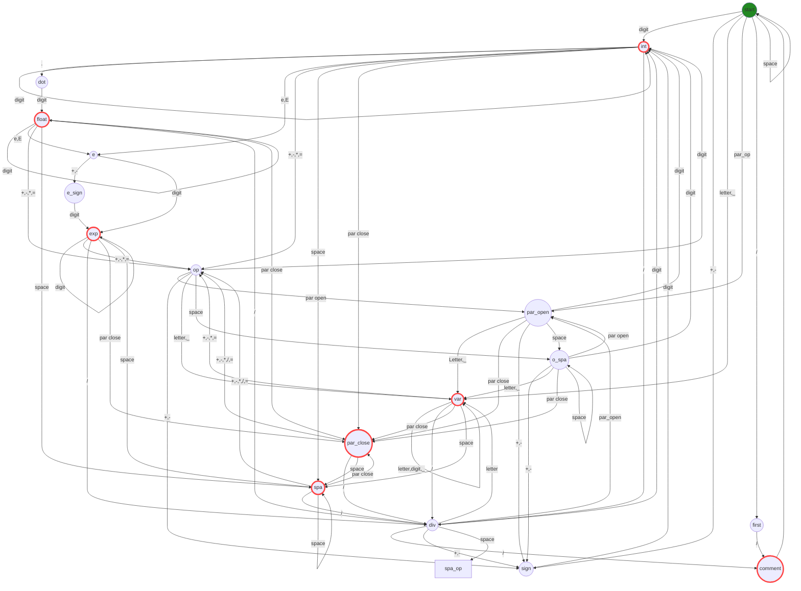

# State diagrams

Diagrams for the Deterministic Finite Automatons (DFA) implemented in Racket

Created using [Mermaid](https://mermaid.js.org/syntax/flowchart.html)

## Arithmetic expressions

Valid arithmetic expressions

Drawn with the tool https://madebyevan.com/fsm/

