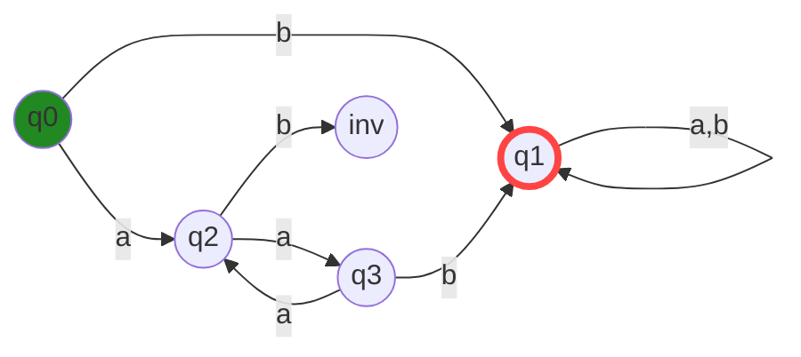
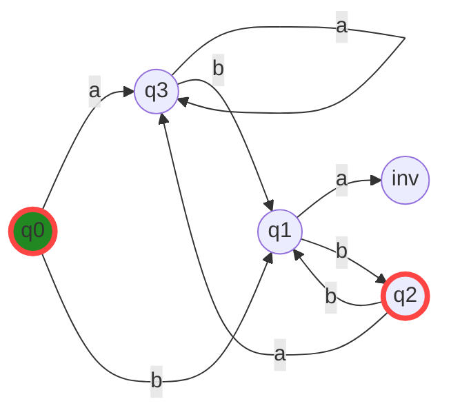
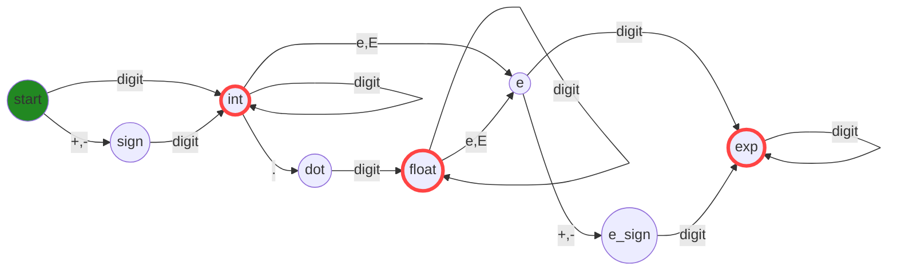
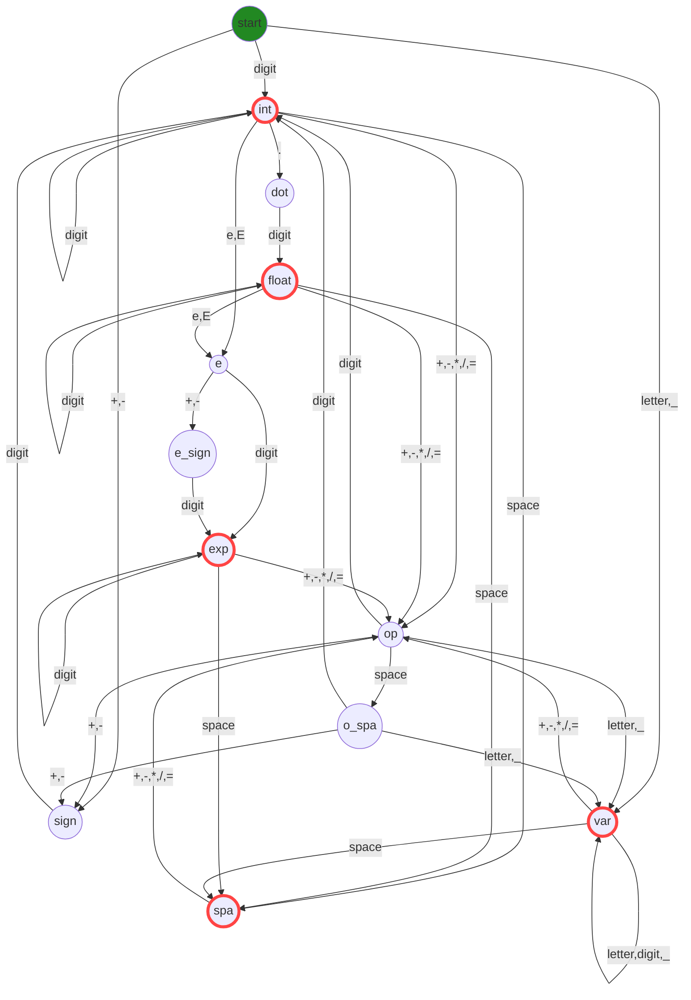

# State diagrams

Diagrams for the Deterministic Finite Automatons (DFA) implemented in Racket

Created using [Mermaid](https://mermaid.js.org/syntax/flowchart.html)

## (aa)\*b[ab]\*

At least one _b_, with an even number of _a_'s before.

## (a*(bb)+)*

Strings with an even number of _b_'s, ending with _b_'s.

## Numbers

Different types of numbers

## Arithmetic expressions

Valid arithmetic expressions

Drawn with the tool https://madebyevan.com/fsm/

