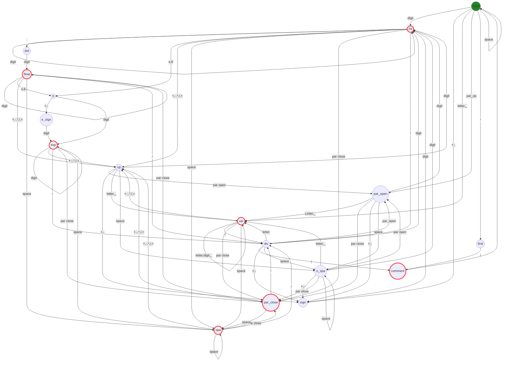

# Arithmetic expressions

The program performs the functions of an automaton as seen below, in this the structure of our finite deterministic automaton (DFA) is created, where we also declared the states of acceptance of the automaton and how it will process the states of any given string of an arithmetical expression, these will be our expressions to analyze. The program will take a character of the string and pass it to our transition function to see if it is a state of our automaton, in case of it not being a valid state, the function will return that it is an invalid state. Otherwise our transition function will accept it and send it to the next state, once it finds an acceptance state the function will return a tuple of the string and what token it represents, adding it a list of lists that is finally returned to the user.

Valid arithmetic expressions

